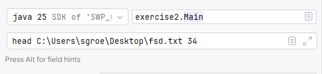

# SWP Groesswang UE01
Stundenaufwand: 5 h

## Aufgabe 1
### Lösungsidee

Hallo wiedereinmal zu einer wunderschönen Programmierübung. Endlich diesmal mit einer angenehmeren Soprache als Java.
In dieser Aufgabe sollen wir die Übung 10 aus dem 2. Semester in Java umsetzten. Zumindest die Programmierteile.

Da der gesamte Code schon in C++ existiert, gibt es einen guten Ansatz für die Algorithmen.

In der Angabe wird ebenfalls der `DataCollector`erwähnt. Im Gegensatz zu der anderen Übung
wird dieser auch erweitert. 

Neben der schon exisiterenden `#actionsOnNumber` Methode gibt es noch eine Methode `#countedEqual`. 
Welche für die einzelnen Zeichenvergleiche verwendet werden. 

Neben dieser bestehenden Logik sollen ebenfalls noch folgende Operationen implementiert werden:
* Anzahl der durchgeführten additiven Operationen,
* Anzahl der durchgeführten multiplikativen Operationen,
* Anzahl der durchgeführten Indizierungen,
* Anzahl der durchgeführten Vergleiche,
* Anzahl der durchgeführten Zuweisungen.

Es gibt verschiedene Ansätze diese Funktionen zu implementieren. Hier wurde darauf entschieden, die Funktionen im ``DataCollector`` implementieren.
Der Vorgang ist hierbei den Rechenprozess als Funktion darzustellen und neben der eigentlichen Funktion wird mitgezählt.

Zum Beispiel wird bei ``#add(int a,int b)`` einfach die Zahlen zusammengezählt und retourniert. Gleichzeitig wird die Anzahl der additiven Operationen um 1 erhöht.
Gleiches bei ``#multiply(int a,int b)`` und ``#<E> assignment(E a)``. Assignment ist hierbei generisch Implementiert, um es für alle Typen zu erlauben. 

Für die Operationen ``+= ; ++`` wird hierbei ersetzt mit einen Aufruf von ``#assignment(add(a,1))`` als Beispiel für `a++`; 

*FunFact*: ``#multiyply(int a,int b)`` wurde nie verwendet, da in den Algorithmen keine Multiplikationen vorkommen.

Spannender wird es bei den Index-Operationen, da diese schwerer mit dieser Idee zum implementierten sind.
Hier wurde entschieden, die Lese und Schreib Operationen getrennt zu implementieren. Es gibt also eine Funktion ``#getIndex(E[] arr, int index)`` und eine Funktion ``#setIndex(E[] arr, int index, int value)``.
Neben einem Array gibt es noch andere Typen, wo eine Indexierung möglich ist. Für diese Typen gibt eine passende Überladung der Funktionen.

Um diese abstrakter zu implementieren, gibt es eine Überladung für List<E> und String. Es wurde auf List entscheiden, da die übergeordnete Klasse ``Collection``
keine Indexierung erhält. 

Für die Vergleiche gibt es die Methode ``#compareTerm(booelan a)`` wo man einfach nur den eigentlichen Vergleich als Parameter übergibt.

Angepasstes Verhalten der Searchmethoden:
-> Bei einer negativen Startposition wird die Suchmethode abgebrochen und -1 returniert. Da hier ein Verwendungsfehler vorliegt.
-> Wenn das Pattern länger als das String ist, wird die Suchmethode abgebrochen und -1 returniert.

Da nun alle FUnktionen implementiert sind, war der nächste Schritt die Algorithmen auf Java zu übersetzen und jegliche Operation durch die Funktionen des DataCollectors zu ersetzen.
Nach diesem Schritt war es nur noch nötig die Statistiken zu ermitteln und diese auf eine CSV auszugeben.

Danach war es Zeit, sich dem Testen zu widmen.

### Testfälle
Da die Algorithmen schon in C++ existieren, gab es schon eine gute Testsuite, die die Algorithmen testet.
Daher wurde hier nur kleine Unittests implementiert, und alle möglichen Operationen wurden getestet.

Die Unit-Tests sind in zwei Bereiche aufgeteilt: Suchalgorithmen und `DataCollector`.

**1) Tests der Suchalgorithmen (`BruteSearch`, `KnuthMorrisPrattSearch`, `BoyerMooreSearch`)**

- **Trefferfälle:** Es wird geprüft, ob bekannte Patterns an den erwarteten Positionen gefunden werden (`0`, `2`, `10`, `17`).
- **Treffer mit Startposition:** Mit einer Startposition (`5`) werden spätere Treffer korrekt gefunden (`10`, `17`).
- **Pattern nicht gefunden:** Rückgabe ist `-1`.
- **Leerer Text:** Rückgabe ist `-1`.
- **Pattern länger als Text:** Rückgabe ist `-1`.
- **Negative Startposition:**
  - `KnuthMorrisPrattSearch` liefert `-1`.
  - `BruteSearch` und `BoyerMooreSearch` werfen aktuell eine `StringIndexOutOfBoundsException`.

**2) Tests des `DataCollector`**

- **Zeichenvergleiche (`countedEqual`)**
  - Korrekte Anzahl der Vergleiche wird gezählt.
  - Korrekte/inkorrekte Vergleiche pro Zeichen werden richtig aggregiert.
- **Arithmetik und Zuweisung**
  - `add`, `multiply` und `assignment` liefern das erwartete Ergebnis.
  - Die jeweiligen Counter werden korrekt inkrementiert.
- **Vergleichsoperationen (`compareTerm`)**
  - Rückgabewert entspricht dem übergebenen Term.
  - Vergleichszähler werden korrekt erhöht.
- **Indexoperationen (`getIndex` fuer `List`, Array, `String`)**
  - Rückgabewerte sind korrekt.
  - Index-Counter wird korrekt inkrementiert.
- **Schreibzugriffe (`setIndexOfCollection`)**
  - Der Zielwert wird korrekt gesetzt.
  - Index- und Assignment-Counter werden korrekt inkrementiert.
- **Unveränderlichkeit der Statistikliste**
  - Die ueber `getCharComparison()` gelieferte Liste ist schreibgeschützt.

Damit decken die Tests sowohl normale Suchfälle als auch wichtige Negativ- und Randfälle ab und
prüfen zusätzlich die korrekte Statistik-Erfassung durch den `DataCollector`.

Da der Inhalt der Statistik überprüft wurde musste jetzt nur noch die CSV-Ausgabe überprüft ob diese Exact ausgeschrieben wurde. Dies wurde mit einer Konsolenausgabe überprüft.
Hier wurde ersichtlich das die Konsolen Ausgabe gleich der CSV-Ausgabe ist.

## Aufgabe 2

### Lösungsidee

*Generelle Informationen*

Zuerst einmal ein kleiner Überblick: Wir sollen 4 verschiedene Linux Shell Befehle nachbauen und diese auch testen.
Die Befehle dabei sollen dabei als eine Methode realisiert werden.

Der Plan für diese Aufgabe is folgender: Die Implementierung der Logik soll dabei in einem seperaten Package ``commands`` liegen.
Diese können dann von 4 verschiedenen ausführbaren Klassen genutzt werden. Welche sich wie ein Konsolen-Programm verhalten.

In der Klasse ``Commands.java`` findet man dabei die Implementierungen der 4 Befehle. Diese geben alle einen `Stringbuilder` zurück welcher 
die Konsolenausgabe enthält.

Für eine interaktive Anwendung wurde noch ein kleines Konsolenprogramm implementiert, wo man einfach per input eine der 4 Befehle auswählen kann.
oder wenn man Programm Argumente angibt kann man das Programm auch direkt starten - einfach bei run-config Argumente angeben:

Als kleines Beispiel - bin mir nicht sicher ob das so gefordert wurde - implementiert ist es auf jeden Fall.

#### Head

Für Head muss eine Zahl mit angegeben werden welche Anzahl der Zeilen ausgegeben werden sollen.
Wenn die Zahl kleiner oder gleich 0 ist kann die Funktionen gleich abgebrocchen werden mit einer ``IllegalArgumentException``.
Wenn das File nicht gefunden wird wird eine ``FileNotFoundException`` geworfen.

Wenn jetzt aber eine Zahl angeben wird, die größer ist als die tatsächliche Anzahl der Zeilen, wird einfach das gesammte File ausgegeben.

#### Tail
Diese Funktion ist ein bisschen spannender als die erste. Hier sollte man vorher wissen wie viele Lines ein File hat um vom Ende aus wegzuzählen.
Alleine vom Gedanken her wäre es am einfachsten, das gesamte File in eine Liste zu packen und von dieser die letzten Zeilen zu extrahieren.
 
Zum Glück gibt es gleich eine Methode in ``java.io.FileReader`` welches das gesamte File in eine Liste packt. Über die Methode `#readAllLines()` wird eine List<String> zurückgegeben,
welche alle Lines des gesammten Files enthält. Von dieser Liste aus kann man direkt auf einen ``ListIterator`` zugreifen. Zusätlich kann man gleich noch angeben an welchen Index der Iterator startet.
Nun muss nur noch über den Iterator nach vorne gegangen werden und voila - man kann von hinten aus die letzten Zeilen extrahieren.

Natürlich kann man auch mit der Kirche ums Kreuz gehen alle Zeilen in eine Liste Packen. Und von hier aus von dem passenden Index weg die Zeilen in den String Builder packen.

Für die Edge Cases gelten die selben Regeln wie bei Head.

#### TreeSize

Diese Methode ist die algorithmisch schwerste. Es springt gleich ins Auge, dass hier die rekursive Methode definitiv am besten ist.
Mittels ``file.length()`` bekommt man die Byte Anzahl des Files, leider aber nicht vom Ordner.

Die leichteste Methode wäre dabei alle Files innerhalb eines Ordners zusammenzuzällen womit man dann die Größe bekommt.
Rekursiv kann man aber nicht verwenden, da es auch Unterordner geben kann. Und der String muss vor der Rekursion aufgebaut werden, damit man die Größe des Ordners bekommt.
Also hierfür müsste man die Größe des Ordners in den String einfügen bevor man überhaupt in den Unterordner geht. - Geht leider nd :cry:

Drehen wir nun den Spieß um - wir gehen in jedes Verzeichniss rein und geben dann die Bytes als Rückgabewert zurück. Dadurch haben wir das gewünschte Ergebnis.
Nur leider am Kopf. ``#reverse()`` funktioniert leider nicht gut genug. Daher Spliten wir einfach den String bei jedem \n und gehen von hinten durch das Array und bauen uns den String wieder auf.
Und voila!

#### Loc

Loc ist hier die leichteste Aufgabe. Hier muss nur File Inhalte eingelesen werden. Hierfür wird wieder der ``FileReader`` genutzt.
Damit erhalten wir eine Liste von Strings. Länge der Liste ist hierbei die Anzahl der Zeilen im File.
Nun muss nurnoch durch jede Zeile am Leerzeichen gesplittet werden. Damit erhalten wir die Anzahl der Spalten, was wiederrum die Anzahl der Wörter in den Zeilen sind.
Die Einzelnen Elemente sind jetzt die einzelnen Zeichen welche nurnoch aufsummiert werden müssen. 

Da in der Angabe nicht spezifiert ist, was ein Wort ist, wird hier keine weitere überprüfung durchgeführt. 
Dabei könnte ``-.-`` auch als Wort gelten.

### Testfälle

Die Tests fuer `exercise2` decken aktuell die Befehle `head`, `tail`, `loc` und `treeSize` ab.

**Head (`HeadTests`)**
- `testHeadWithExistingFile`: Gibt die ersten 3 Zeilen aus `TestFile1` korrekt zurueck (`a`, `b`, `c`).
- `testHeadWithNonExistingFile`: Bei nicht existierender Datei wird `FileNotFoundException` erwartet.
- `testHeadWithNegativeNumberOfLines`: Bei negativer Zeilenzahl wird `IllegalArgumentException` erwartet.
- `testHeadWithMoreLinesThanFile`: Wenn mehr Zeilen angefordert werden als vorhanden, wird die komplette Datei (`TestFile2`) ausgegeben.

**Tail (`TailTest`)**
- `testTailWithExistingFile`: Gibt die letzten 3 Zeilen aus `TestFile1` korrekt zurueck (`x`, `y`, `z`).
- `testTailWithNonExistingFile`: Bei nicht existierender Datei wird `FileNotFoundException` erwartet.
- `testTailWithNegativeNumberOfLines`: Bei negativer Zeilenzahl wird `IllegalArgumentException` erwartet.
- `testTailWithMoreLinesThanFile`: Wenn mehr Zeilen angefordert werden als vorhanden, wird die komplette Datei (`TestFile2`) ausgegeben.

**Loc (`LocTest`)**
- `testLocWithExistingFile`: `TestFile1` wird als `LocStatistics(26, 26, 26)` validiert.
- `testLocWithTestFile2`: `TestFile2` wird als `LocStatistics(3, 3, 11)` validiert.
- `testLocWithTestFile3`: `TestFile3` wird als `LocStatistics(6, 14, 49)` validiert.
- `testLocWithNonExistingFile`: Bei nicht existierender Datei wird eine Exception erwartet.

**TreeSize (`TreeTests`)**
- `testTreeSizeWithInvalidDirectoryPath`: Ungültiger Pfad führt zu `IllegalArgumentException`.
- `testTreeSizeWithFilePathInsteadOfDirectory`: Datei statt Verzeichnis führt zu `IllegalArgumentException`.
- `testTreeSizeWithEmptyDirectory`: Leeres Verzeichnis wird mit `0 bytes` ausgegeben.
- `testTreeSizeWithNestedDirectoryAndFile`: Rekursive Berechnung für Unterordner und Datei liefert die erwartete Gesamtgröße und Struktur.

**Annotation `@TempDir` in `TreeTests`**
- `@TempDir` erstellt für jeden Test automatisch ein temporäres Verzeichnis.
- Dadurch sind die Tests isoliert und unabhängig vom echten Projekt-Dateisystem.
- Das Verzeichnis wird von JUnit nach dem Testlauf wieder aufgeräumt.
